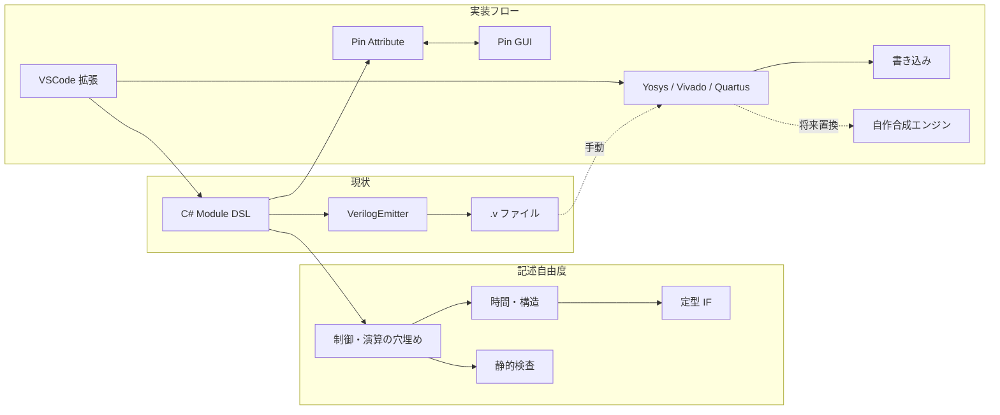
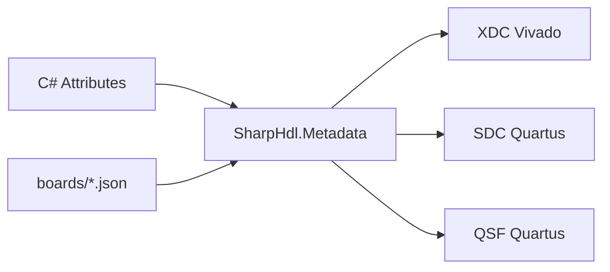
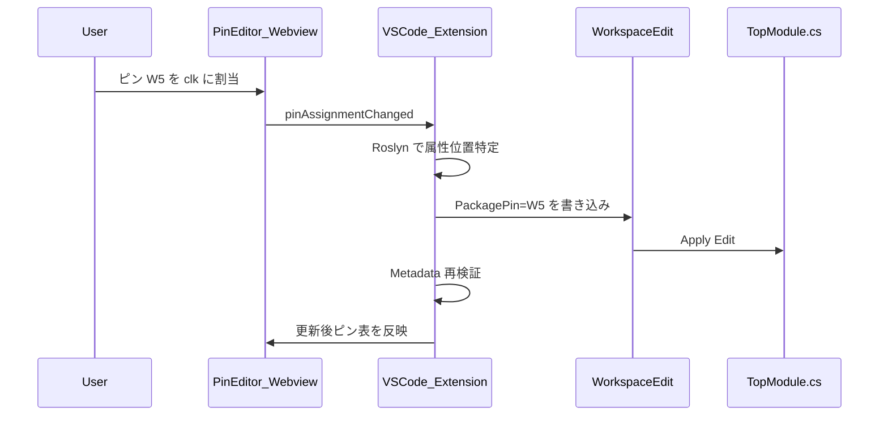
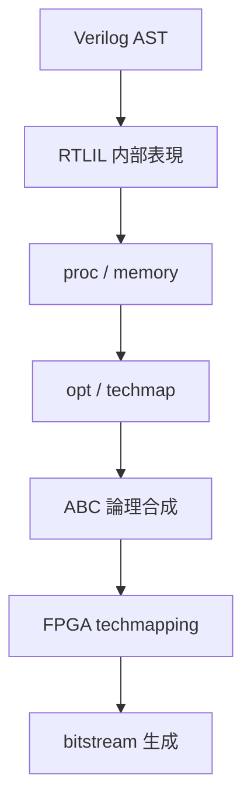
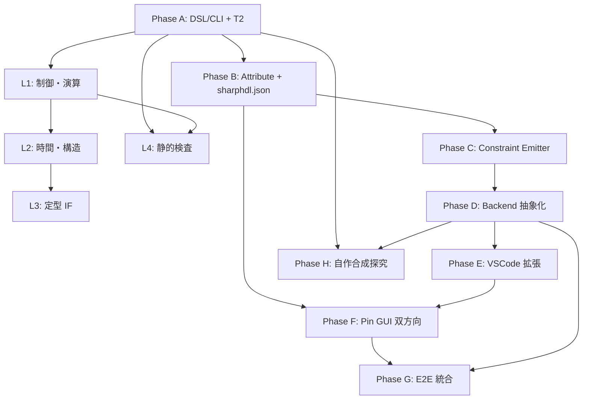

# SharpHDL 長期開発計画

VSCode 上で HDL 記述から FPGA 書き込みまで一貫して行える環境を目指す長期計画です。  
実装は人手主体とし、エージェントは明示的な指示があった場合のみコード変更を行います。

関連: [ROADMAP.md](ROADMAP.md)（Phase 0–4）、[phase-checklist.md](phase-checklist.md)、[tickets/riscv-sharp-requests.md](tickets/riscv-sharp-requests.md)

拡張は **二つの軸** に分ける（混ぜない）:

| 軸 | 中身 | 本ドキュメント |
|----|------|----------------|
| **記述自由度（DSL）** | 何を C# で書けるか（原語・時間モデル・定型 IF） | Phase A の続き + 下記「記述自由度の拡張」 |
| **実装フロー（ツール）** | ピン・制約・合成・VSCode・書き込み | Phase B–H |

消費者が Verilog を手元で合成するだけなら軸1を優先。FPGA 一気通貫が目標なら軸2も進める。

---

## 現状の位置づけ

SharpHDL（リポジトリ名: CsharpHdl）は **C# → Verilog-2001** の早期段階ツールです。

| 領域 | 状態 |
|------|------|
| DSL（Comb/Seq/Switch） | 部分実装済み（[SharpHdl.Core](../src/SharpHdl.Core/)） |
| Mem / 階層 / Slice・Concat / 2R1W / wstrb | T2a–T2d 相当まで進捗（[tickets/riscv-sharp-requests.md](tickets/riscv-sharp-requests.md)） |
| 符号拡張（T2e） | **未** |
| Verilog 生成 | ALU/カウンタ/Mem 等（[VerilogEmitter.cs](../src/SharpHdl.Emit/VerilogEmitter.cs)） |
| CLI | スタブ・未完成（[Program.cs](../src/SharpHdl.Cli/Program.cs)） |
| Attribute / ピンアサイン | **未着手**（[dsl-spec.md](dsl-spec.md) に命名属性の言及のみ） |
| Yosys / Vivado / Quartus | README 言及のみ、**統合なし** |
| VSCode 拡張 | **未着手**（[ROADMAP.md](ROADMAP.md) では GUI も初期スコープ外） |

既存ロードマップ（Phase 0–4, G0–G4）を **前提** とし、その先を **記述自由度（L1–L4）** と **ツール（Phase B–H）** として拡張します。



---

## 作業原則（エージェントとの協調）

- **実装は人手主体**。エージェントは明示的な実装指示があった場合のみコード変更を行う
- 本体（Core / Emit / Cli / 拡張本体）への変更許可がない指示では、**テスト・ドキュメント・設計メモ・スケルトン** に留める
- 各フェーズは **仕様ドキュメント → インターフェース定義 → 実装 → テスト** の順。仕様先行で GUI ↔ ソース双方向同期の契約を先に固める

---

## Phase A: 既存ロードマップ完遂（Phase 2–4）

**目的:** 以降の全機能の土台を安定させる。

### A1 — Phase 2 完了（DSL + Emitter）

- [phase-checklist.md](phase-checklist.md) の Phase 2 項目を完了
- 幅チェック、`If`/`Else`、比較演算（[dsl-spec.md](dsl-spec.md) §4）
- スナップショットテスト維持（[SharpHdl.Tests](../src/SharpHdl.Tests/)）

### A2 — Phase 3（CPU/SoC 向け）

- `Mem`（1R1W 同期）、階層モジュール、スライス/連結（[guides/phase-3-cpu-ready.md](guides/phase-3-cpu-ready.md)）
- 複数モジュールの連結出力
- RV64 向け原語チケット T2（[tickets/riscv-sharp-requests.md](tickets/riscv-sharp-requests.md)）— T2a–T2d 完了、**T2e（符号拡張）がゲート**

### A3 — Phase 4（CLI・配布）

- [cli-spec.md](cli-spec.md) の `emit` / `list` / `version` を実装
- `dotnet pack` と [consumers.md](consumers.md) 手順の検証
- Verilator パース確認（G4）

**完了条件:** `dotnet test` 緑、`sharphdl emit --top Alu -o out/alu.v` が 0 終了、examples が Verilator で通る。

---

## 記述自由度の拡張（DSL 本線・T2 以降）

**目的:** 消費者が DSL をフォークせず、CPU/SoC を書き続けられるように原語を足す。  
**原則:** 一気に全部やらない。**消費者の痛みが出てから**足す。ISA 固有ロジックは消費者側。  
**ゲート:** T2（とくに T2e）完了後に L1 以降を本格化。B–H（ツール）とは独立に進められる。

### L1 — 組み合わせ・制御の穴埋め（優先してよい）

- `If` / `Else`、比較、`^` / `~`、シフト
- 左辺部分代入（`x[7:0] = …`）— T2b で後回しにした分
- パラメータ／ジェネリック幅の整理

→ 「小さなデータパス」から「普通の制御付きモジュール」へ。

### L2 — 時間・構造モデル（必要になってから）

- 複数クロック／リセット極性
- generate 相当（繰り返しインスタンス）
- FSM 用の状態型（任意 C# ではなく制約付き）
- パイプライン段の **明示**（自動挿入はしない）

→ SoC っぽい階層＋同期の書き方が広がる。

### L3 — インタフェース原語（必要になってから）

- valid/ready、AXI-lite 級の束、FIFO
- クロックドメイン交差の定型

→ 配線地獄を原語で減らし、「接続の自由度」が上がる（特定 ISA は入れない）。

### L4 — 検証・意味論の安全網（L1 と並行）

- Verilator 回帰（G4）を維持・拡大
- 幅・駆動・組み合わせループ等の静的検査を強化

→ 自由度を増やすほどここで縛らないと壊れやすい。

### 意図的に後回し／やらない（記述自由度側）

| やらない | 理由 |
|----------|------|
| 任意 C# の HLS 変換 | 制御不能・HDL ではない |
| 暗黙クロック／暗黙の符号拡張 | バグの温床（[dsl-spec.md](dsl-spec.md) §6） |
| パイプライン自動挿入 | 意図が読めなくなる |
| SystemVerilog 高度機能の全対応 | スコープ膨張 |

**完了の見方:** マイルストーンではなくチェックリスト。消費者チケットまたは具体的な書けない回路が出たら該当 L を切る。

---

## Phase B: メタデータ基盤 — Attribute とプロジェクト設定

**目的:** ピンアサイン・ボード定義・バックエンド選択の **単一の意味論** を確立する。

### B1 — Attribute 仕様（新規: [pin-attribute-spec.md](pin-attribute-spec.md)）

C# ソースを **正（Source of Truth）** とし、GUI は Attribute を編集して書き戻す方針。

```csharp
// 概念例（仕様確定後に Core に追加）
[ModuleName("top")]
public sealed class Top : Module
{
    [Pin("clk", PackagePin = "W5", IOSTandard = "LVCMOS33", Bank = "34")]
    public In Clk { get; } = In.Clock("clk");

    [Pin("led[0]", PackagePin = "H17", IOSTandard = "LVCMOS33")]
    public Out Led0 { get; } = Out.UInt(1, "led0");
}
```

| Attribute フィールド | 用途 |
|---------------------|------|
| `PackagePin` | 物理ピン（例: `W5`） |
| `IOStandard` | 電気特性（LVCMOS33 等） |
| `Bank` / `Drive` / `Pull` | ベンダ共通 + 拡張 |
| `ConstraintGroup` | タイミンググループ（将来） |

- モジュール名上書きは既存 [dsl-spec.md](dsl-spec.md) §7 と整合
- **Roslyn 解析可能** な通常の C# Attribute に限定（GUI 書き戻しのため）

### B2 — ボード定義（新規: `boards/*.json`）

- FPGA パート名、ピン一覧（PackagePin ↔ 論理名）、クロック定義
- 例: `boards/digilent_basys3.json`, `boards/tinytapeout.json`
- Attribute の `PackagePin` 検証に使用（存在しないピンは emit 前エラー）

### B3 — プロジェクト設定（新規: `sharphdl.json`）

名称は要決定。以下を宣言:

```json
{
  "top": "MyProject.Top",
  "board": "boards/digilent_basys3.json",
  "backend": "yosys",
  "emit": { "outputDir": "rtl/generated" },
  "constraints": { "outputDir": "constraints/generated" }
}
```

- 消費者リポジトリ（MyOsProject 等）の `.csproj` と併置
- CLI / VSCode / GUI が同じ設定を参照

### B4 — 新規プロジェクト `SharpHdl.Metadata`（推奨）

Core を汚さず、Attribute 定義・ボード JSON デシリアライズ・検証ロジックを分離:

```
src/
  SharpHdl.Metadata/     # Attribute 型、BoardModel、PinValidator
  SharpHdl.Constraints/  # XDC / SDC / QSF 生成（Phase C 以降）
```

**完了条件:** 仕様ドキュメント + Metadata の型定義 + ボード JSON 1 枚 + ユニットテスト（ピン検証のみ、Emit 非依存）。

---

## Phase C: 制約ファイル生成（Constraint Emitter）

**目的:** Attribute + ボード定義からベンダ別制約を自動生成。



| 出力 | 対象 | 生成元 |
|------|------|--------|
| `.xdc` | Vivado / 一部 Yosys+nextpnr | `[Pin]` + クロック定義 |
| `.sdc` | Quartus / Timing | 同上 |
| `.qsf` / `.pin` | Quartus ピン | 同上 |
| `.pcf` | Lattice / nextpnr | 将来 |

- `SharpHdl.Constraints` にテンプレートベース Emitter
- **ゴールデンテスト:** 既知ボード + 既知 Top モジュール → 期待 XDC/SDC 文字列

**完了条件:** 1 ボード・1 トップで 3 形式すべて生成、手動で Vivado/Quartus にインポート可能。

---

## Phase D: バックエンド抽象化（マルチプラットフォーム）

**目的:** Yosys / Vivado / Quartus を **同じ CLI インターフェース** で呼び出す。

### D1 — `IBackend` 契約（新規: [backend-spec.md](backend-spec.md)）

```csharp
interface IBackend
{
    string Id { get; }           // "yosys", "vivado", "quartus"
    Task<BuildResult> Synthesize(BuildContext ctx);
    Task<BuildResult> PlaceAndRoute(BuildContext ctx);  // P&R が分離できるツールのみ
    Task<FlashResult> Program(ProgramContext ctx);      // オプション
}
```

`BuildContext` に含めるもの:

- 生成済み `.v` パス
- 制約ファイルパス
- ボード/デバイス名
- 作業ディレクトリ

### D2 — 各バックエンド実装（薄いラッパ）

| Backend | 外部コマンド | 主な出力 |
|---------|-------------|----------|
| **Yosys** | `yosys`, `nextpnr-*`（必要時） | `.json`, bitstream 中間 |
| **Vivado** | `vivado -mode batch -source flow.tcl` | `.bit`, `.ltx` |
| **Quartus** | `quartus_sh --flow compile` | `.sof` / `.pof` |

- Tcl/スクリプトは `templates/backends/{yosys,vivado,quartus}/` に配置
- CLI 拡張: `sharphdl build --backend yosys`, `sharphdl program`

### D3 — 書き込み（Program）

- OpenOCD / Vivado Hardware Manager / `quartus_pgm` 等を `IBackend.Program` から呼び分け
- ボード JSON に `programmer` フィールド（例: `{ "tool": "openocd", "cfg": "..." }`）

**完了条件:** 1 つの example 設計を 3 バックエンドのうち **利用可能なもの** で bitstream まで到達（環境依存のため CI では dry-run + スクリプト生成確認）。

---

## Phase E: VSCode 拡張

**目的:** 編集 → 生成 → 合成 → 書き込みを VSCode 内で一貫。

### E1 — リポジトリ構成（別パッケージ推奨）

```
vscode-sharphdl/
  package.json
  src/
    extension.ts          # コマンド登録
    lsp/                  # 将来: C# LSP 連携 or 軽量 Diagnostics
    pinEditor/            # Webview ピン GUI
    backendRunner.ts      # CLI sharphdl を spawn
```

- 初期は **Task + Command** 中心（LSP は後回し可）
- `sharphdl.json` をワークスペース設定として読み込み

### E2 — VSCode コマンド

| コマンド | 動作 |
|----------|------|
| `SharpHDL: Emit Verilog` | CLI `emit` 実行、出力パネル表示 |
| `SharpHDL: Build` | `build --backend <configured>` |
| `SharpHDL: Program Device` | `program` |
| `SharpHDL: Open Pin Editor` | Webview GUI |

### E3 — tasks.json スニペット提供

拡張が `sharphdl.json` から自動生成する **contributed tasks** を提供（手動 tasks.json 編集を最小化）。

**完了条件:** VSCode から Emit → Build → Program の Happy Path を 1 ボードでデモ可能。

詳細仕様: [vscode-extension-spec.md](vscode-extension-spec.md)（未作成）

---

## Phase F: ピンアサイン GUI ↔ ソース自動同期

**目的:** GUI でピンを変更すると C# Attribute が自動更新される。



### F1 — ピンエディタ UI

- ボード JSON からパッケージピン一覧を表示（SVG フットプリントは将来）
- モジュールの `[Pin]` 付きポートとドラッグ&ドロップ or ドロップダウンで紐付け
- 未割当 / 競合 / 無効ピンを Diagnostics 表示

### F2 — ソース書き戻し戦略

1. **Roslyn WorkspaceEdit**（推奨）: 属性引数のみ surgical に更新
2. 属性が無いポート: 新規 `[Pin(...)]` 行を挿入（ポート宣言の直前）
3. フォーマット: `.editorconfig` / C# formatter に従う

### F3 — 双方向整合

- ソース手編集 → GUI はファイル watcher で再読込
- 競合時（GUI 開いたまま手編集）: 「再読込」プロンプト

**完了条件:** GUI 操作だけで TopModule.cs の Attribute が更新され、再 Emit → 制約ファイルに反映される。

---

## Phase G: エンドツーエンド統合

**目的:** 「VSCode で書いて、ボタン一つで FPGA に書き込む」体験の完成。

### 統合フロー

```
1. C# Module 記述 + [Pin] Attribute（または GUI で設定）
2. Save → optional auto-emit
3. Build（backend 選択）
4. Program
5. シミュレーション（Verilator）は別コマンドで並行利用
```

### CI / 品質

- GitHub Actions: `dotnet test` + Verilator パース + 制約ファイルゴールデン
- 合成はランナーに Vivado/Quartus ライセンスが無いため **スクリプト生成の snapshot テスト** に留める

**完了条件:** [e2e-workflow.md](e2e-workflow.md) に 1 ボード完走手順、VSCode デモ動画またはスクリーンショット。

---

## Phase H: 技術探究 — Yosys バックエンドの自作置換

**目的:** 合成パイプラインを学習・制御するため、Yosys が担う部分を段階的に自前実装。**最終段階・長期**。

### H0 — Yosys パイプラインの分解（調査のみ）



自作置換の現実的順序:

| 段階 | 内容 | 難易度 | SharpHDL との接点 |
|------|------|--------|-------------------|
| H1 | 内部 IR 設計（RTLIL 相当） | 中 | Emit 後 or Emit 直接 IR |
| H2 | 組合せ最適化（定数畳み等） | 中 | IR パス |
| H3 | 論理合成（AIG/CNF → LUT） | 高 | ABC 連携 or 自前 |
| H4 | FPGA techmap（LUT/FF/BRAM） | 高 | デバイス XML |
| H5 | P&R / bitstream | 極高 | nextpnr 連携 or 完全自作 |

### H1 — 最初の一歩（推奨）

- **SharpHDL AST → 内部 IR** を直接生成（Verilog を経由しない経路を追加検討）
- 既存 [VerilogEmitter.cs](../src/SharpHdl.Emit/VerilogEmitter.cs) はシミュレーション・外部ツール互換用に維持
- 新規 `SharpHdl.Synth` プロジェクト（探究用、本番バックエンドとは feature flag で切替）

### H2 — Yosys との共存

- `sharphdl.json`: `"backend": "yosys" | "sharphdl-synth" | "vivado" | "quartus"`
- 同一設計で Yosys 出力 vs 自作出力を **等価性テスト**（LUT 数、タイミング概算）

### H3 — ドキュメント

- [synth-research-log.md](synth-research-log.md) に各ステージの調査・実験結果を記録（実装は人手）

**完了条件（探究）:** 小規模モジュール（ALU, counter）で自作 IR → LUT netlist まで到達。bitstream 完全自作は Optional 長期目標。

---

## 推奨実装順序（依存関係）



記述自由度（L）とツール（B–H）は **A 完了後に並行可能**。RISC-Sharp 線なら L を先に、FPGA 一気通貫線なら B 以降も進める。

---

## ドキュメント追加計画

| 新規ドキュメント | 内容 | 状態 |
|------------------|------|------|
| [pin-attribute-spec.md](pin-attribute-spec.md) | Attribute フィールド、検証規則 | 未作成 |
| [backend-spec.md](backend-spec.md) | IBackend、BuildContext、CLI 拡張 | 未作成 |
| [vscode-extension-spec.md](vscode-extension-spec.md) | コマンド、Webview、設定 | 未作成 |
| [e2e-workflow.md](e2e-workflow.md) | ボード別完走手順 | 未作成 |
| [synth-research-log.md](synth-research-log.md) | Yosys 置換の探究ログ | 未作成 |
| [long-term-plan.md](long-term-plan.md) | 本ドキュメント | 作成済み |

---

## リスクと方針

| リスク | 対策 |
|--------|------|
| GUI ↔ ソース同期でフォーマット崩れ | Roslyn WorkspaceEdit + スナップショットテスト |
| ベンダツールのライセンス/CI | CI は生成物検証のみ、合成はローカル |
| Core が肥大化 | Metadata / Constraints / Backends / Synth をプロジェクト分割 |
| DSL 原語の無秩序な増加 | L1–L4 とチケットで優先度を切る。ISA は消費者側。痛みが出てから足す |
| 自作合成のスコープ膨張 | H1–H3 までを探究マイルストーン、bitstream は明示的 Optional |
| エージェントによる意図しない本体変更 | 指示範囲を PR/コミットメッセージで明示、「テストのみ可」フラグ運用 |

---

## 最初に着手すべき具体タスク（人手）

1. T2e（SignExtend / ZeroExtend）で RV64 向け原語チケットを閉じる（[tickets/riscv-sharp-requests.md](tickets/riscv-sharp-requests.md)）
2. Phase 2 チェックリスト残り（[phase-checklist.md](phase-checklist.md)）— L1 と重なる項目はここで消化
3. 消費者の「書けない」が出たら L1–L3 の該当項だけ切る（一括実装しない）
4. [pin-attribute-spec.md](pin-attribute-spec.md) の起草（フィールド一覧と 1 ボード例）— ツール軸を進める場合
5. `boards/` に最初のボード JSON を 1 枚追加
6. [ROADMAP.md](ROADMAP.md) の Phase 5+ セクションと本計画の整合確認

エージェントへの依頼例（本体に触れない場合）:

- 「`docs/pin-attribute-spec.md` のドラフトを書いて」
- 「Metadata の PinValidator ユニットテストだけ追加して（Core は触らない）」
- 「Yosys ラッパの CLI 統合テスト用モックを Tests に追加」
- 「T2e のテストと dsl-spec 更新だけやって」

---

## 改版履歴

| 版 | 日付 | 変更 |
|----|------|------|
| 1.1 | 2026-09-11 | 記述自由度軸（L1–L4）を統合。ツール軸（B–H）と分離 |
| 1.0 | 2026-09-02 | 初版（長期計画として docs に追加） |
